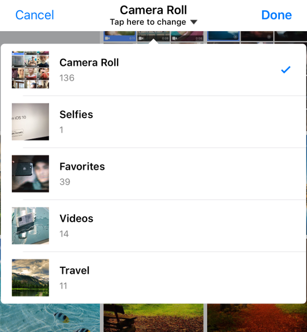
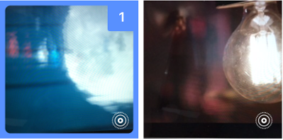
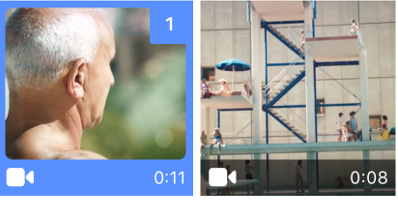

[](http://cocoapods.org/pods/BBLPhotoPicker)
[](http://cocoapods.org/pods/BBLPhotoPicker)
[](http://cocoapods.org/pods/BBLPhotoPicker)


## Written in Swift 5.0

BBLPhotoPicker enables application to pick images and videos from multiple smart album in iOS, similar to the current facebook app.

## Demo 🙉

| Facebook Picker | BBLPhotoPicker  |
| ------------- | ------------- |
|   |   |

## Features

- support smart album collection. 
  - camera roll, selfies, panoramas, favorites, videos, custom users album
- selected order index.
- playback video and live photos.
  - just one. playback first video or live Photo in bounds of visible cell.
- display video duration.
- async phasset request and displayed cell.
  - scrolling performance is better than facebook in displaying video assets collection.
- custom cell
- custom display and selection rules
- reload of changes that occur in the Photos library.
- support iCloud Photo Library
- adds long press preview to images. ( to @smeshko ) [Preview](https://github.com/tilltue/BBLPhotoPicker/pull/252#issue-362005178)

| Smart album collection | LivePhotoCell | VideoPhotoCell  | PhotoCell | CustomCell(instagram) |
| ------------- | ------------- | ------------- | ------------- | ------------- |
|   |   |   |   |   |

Custom Camera Cell

| Live CameraCell |
| ------------- |
| 

## Installation 

### Requirements 

- Swift 5.0 ( Swift 4.2 -> use 'version 1.8.3' )
- iOS 9.1 (for use live photos)

### Cocoapods

BBLPhotoPicker is available through [CocoaPods](http://cocoapods.org). To install
it, simply add the following line to your Podfile:

```ruby
platform :ios, '9.1'
pod "BBLPhotoPicker"
```

### Carthage

Carthage is a simple, decentralized dependency manager for Cocoa.

Specify BBLPhotoPicker into your project's Cartfile:

```
github "tilltue/BBLPhotoPicker"
```

### Swift Package Manager

The Swift Package Manager is a tool for automating the distribution of Swift code and is integrated into the swift compiler. It is in early development, but BBLPhotoPicker does support its use on supported platforms.

Once you have your Swift package set up, adding Alamofire as a dependency is as easy as adding it to the dependencies value of your Package.swift.

```
dependencies: [
    .package(url: "https://github.com/tilltue/BBLPhotoPicker.git", .upToNextMajor(from: "2.1.0"))
]
```

> Don't forget the Privacy Description in `info.plist`.


> iOS 14
> You can suppress the automatic prompting from the system by setting this key to yes in your apps info plist.
> PHPhotoLibraryPreventAutomaticLimitedAccessAlert = YES
https://developer.apple.com/videos/play/wwdc2020/10641/

## Usage 

**use delegate**

You can choose delegate method or closure for handle picker event.

```swift 
class ViewController: UIViewController,BBLPhotosPickerViewControllerDelegate {
    var selectedAssets = [BBLPHAsset]()
    @IBAction func pickerButtonTap() {
        let viewController = BBLPhotosPickerViewController()
        viewController.delegate = self
        var configure = BBLPhotosPickerConfigure()
        //configure.nibSet = (nibName: "CustomCell_Instagram", bundle: Bundle.main) // If you want use your custom cell..
        self.present(viewController, animated: true, completion: nil)
    }
    //BBLPhotosPickerViewControllerDelegate
    func shouldDismissPhotoPicker(withBBLPHAssets: [BBLPHAsset]) -> Bool {
        // use selected order, fullresolution image
        self.selectedAssets = withBBLPHAssets
	return true
    }
    func dismissPhotoPicker(withPHAssets: [PHAsset]) {
        // if you want to used phasset. 
    }
    func photoPickerDidCancel() {
        // cancel
    }
    func dismissComplete() {
        // picker viewcontroller dismiss completion
    }
    func canSelectAsset(phAsset: PHAsset) -> Bool {
        //Custom Rules & Display
        //You can decide in which case the selection of the cell could be forbidden. 
    }
    func didExceedMaximumNumberOfSelection(picker: BBLPhotosPickerViewController) {
        // exceed max selection
    }
    func handleNoAlbumPermissions(picker: BBLPhotosPickerViewController) {
        // handle denied albums permissions case
    }
    func handleNoCameraPermissions(picker: BBLPhotosPickerViewController) {
        // handle denied camera permissions case
    }
}

```
**use closure**

```swift
    init(withPHAssets: (([PHAsset]) -> Void)? = nil, didCancel: ((Void) -> Void)? = nil)
    init(withBBLPHAssets: (([BBLPHAsset]) -> Void)? = nil, didCancel: ((Void) -> Void)? = nil)
    var canSelectAsset: ((PHAsset) -> Bool)? = nil
    var didExceedMaximumNumberOfSelection: ((BBLPhotosPickerViewController) -> Void)? = nil
    var handleNoAlbumPermissions: ((BBLPhotosPickerViewController) -> Void)? = nil
    var handleNoCameraPermissions: ((BBLPhotosPickerViewController) -> Void)? = nil
    var dismissCompletion: (() -> Void)? = nil
```
```swift
class ViewController: UIViewController,BBLPhotosPickerViewControllerDelegate {
    var selectedAssets = [BBLPHAsset]()
    @IBAction func pickerButtonTap() {
        let viewController = BBLPhotosPickerViewController(withBBLPHAssets: { [weak self] (assets) in // BBLAssets
            self?.selectedAssets = assets
        }, didCancel: nil)
        viewController.didExceedMaximumNumberOfSelection = { [weak self] (picker) in
            //exceed max selection
        }
        viewController.handleNoAlbumPermissions = { [weak self] (picker) in
            // handle denied albums permissions case
        }
        viewController.handleNoCameraPermissions = { [weak self] (picker) in
            // handle denied camera permissions case
        }
        viewController.selectedAssets = self.selectedAssets
        self.present(viewController, animated: true, completion: nil)
    }
}

```

**Custom Cell**
Custom Cell must subclass BBLPhotoCollectionViewCell
```Swift
class CustomCell_Instagram: BBLPhotoCollectionViewCell {

}

//If you want custom camera cell?
//only used camera cell
[Sample](https://github.com/tilltue/BBLPhotoPicker/blob/master/Example/BBLPhotoPicker/CustomCameraCell.swift)

//Adding the possibility to handle cell display according to a specific conditions
func update(with phAsset: PHAsset)
func selectedCell()
func willDisplayCell()
func endDisplayingCell()
```

**Custom Rules & Display**

You can implement your own rules to handle the cell display. You can decide in which case the selection of the cell could be forbidden. 

For example, if you want to disable the selection of a cell if its width is under 300, you can follow these steps:

- Override the update method of your custom cell and add your own display rule 

```swift
override func update(with phAsset: PHAsset) {
    super.update(with: phAsset)
    self.sizeRequiredOverlayView?.isHidden = !(phAsset.pixelHeight <= 300 && phAsset.pixelWidth <= 300)
}
``` 
In this code, we show an overlay when the height and width required values are not satisified.

- When you instanciate a `BBLPhotosPickerViewController` subclass, you can pass a closure called `canSelectAsset` to handle the selection according to some rules.  ( or delegate)

```Swift
//use delegate 
public protocol BBLPhotosPickerViewControllerDelegate: class {
    ...
    func canSelectAsset(phAsset: PHAsset) -> Bool
    ...
}

extension UserViewController: BBLPhotosPickerViewControllerDelegate {
    func canSelectAsset(phAsset: PHAsset) -> Bool {
        if asset.pixelHeight < 100 || asset.pixelWidth < 100 {
            self?.showUnsatisifiedSizeAlert(vc: viewController)
            return false
        }
        return true
    }
}

//or use closure
viewController.canSelectAsset = { [weak self] asset -> Bool in
    if asset.pixelHeight < 100 || asset.pixelWidth < 100 {
        self?.showUnsatisifiedSizeAlert(vc: viewController)
        return false
    }
    return true
}
```
In this code, we show an alert when the condition in the closure are not satisfiied.

**BBLPHAsset**

```swift
public struct BBLPHAsset {
    public enum AssetType {
        case photo,video,livePhoto
    }
    // phasset 
    public var phAsset: PHAsset? = nil
    // selected order index
    public var selectedOrder: Int = 0
    // asset type
    public var type: AssetType
    // get full resolution image 
    public var fullResolutionImage: UIImage?
    // get photo file size (async)
    public func photoSize(options: PHImageRequestOptions? = nil ,completion: @escaping ((Int)->Void), livePhotoVideoSize: Bool = false)
    // get video file size (async)
    public func videoSize(options: PHVideoRequestOptions? = nil, completion: @escaping ((Int)->Void))
    // get async icloud image (download)
    @discardableResult
    public func cloudImageDownload(progressBlock: @escaping (Double) -> Void, completionBlock:@escaping (UIImage?)-> Void ) -> PHImageRequestID?
    // get original media file async copy temporary media file ( photo(png,gif...etc.) and video ) -> Don't forget, You should delete temporary file.
    // parmeter : convertLivePhotosToJPG
    // false : If you want mov file at live photos
    // true  : If you want png file at live photos ( HEIC )
    public func tempCopyMediaFile(videoRequestOptions: PHVideoRequestOptions? = nil, 
                                  imageRequestOptions: PHImageRequestOptions? = nil,
                                  livePhotoRequestOptions: PHLivePhotoRequestOptions? = nil,
                                  exportPreset: String = AVAssetExportPresetHighestQuality, 
                                  convertLivePhotosToJPG: Bool = false, 
                                  progressBlock:((Double) -> Void)? = nil, 
                                  completionBlock:@escaping ((URL,String) -> Void)) -> PHImageRequestID?
    //Apparently, This is not the only way to export video.
    //There is many way that export a video.
    //This method was one of them.
    public func exportVideoFile(options: PHVideoRequestOptions? = nil,
                                outputURL: URL? = nil,
                                outputFileType: AVFileType = .mov,
                                progressBlock:((Double) -> Void)? = nil,
                                completionBlock:@escaping ((URL,String) -> Void))
    // get original asset file name
    public var originalFileName: String?
}
```
>  Note:  convenience export method
>  fullResolutionImage, cloudImageDownload, tempCopyMediaFile, exportVideoFile
>  It's not enough if you wanted to use more complicated export asset options. ( progress, export type, etc..)

## Customize 

```swift
let viewController = BBLPhotosPickerViewController()
var configure = BBLPhotosPickerConfigure()
viewController.configure = configure

public struct BBLPhotosPickerConfigure {
    public var customLocalizedTitle: [String: String] = ["Camera Roll": "Camera Roll"] // Set [:] if you want use default localized title of album
    public var tapHereToChange = "Tap here to change"
    public var cancelTitle = "Cancel"
    public var doneTitle = "Done"
    public var emptyMessage = "No albums"
    public var emptyImage: UIImage? = nil
    public var usedCameraButton = true
    public var usedPrefetch = false
    public var previewAtForceTouch = false
    public var allowedLivePhotos = true
    public var allowedVideo = true
    public var allowedAlbumCloudShared = false
    public var allowedPhotograph = true // for camera : allow this option when you want to take a photos
    public var allowedVideoRecording = true //for camera : allow this option when you want to recording video.
    public var recordingVideoQuality: UIImagePickerControllerQualityType = .typeMedium //for camera : recording video quality
    public var maxVideoDuration:TimeInterval? = nil //for camera : max video recording duration
    public var autoPlay = true
    public var muteAudio = true
    public var preventAutomaticLimitedAccessAlert = true // newest iOS 14
    public var mediaType: PHAssetMediaType? = nil
    public var numberOfColumn = 3
    public var minimumLineSpacing: CGFloat = 5
    public var minimumInteritemSpacing: CGFloat = 5
    public var singleSelectedMode = false
    public var maxSelectedAssets: Int? = nil //default: inf
    public var fetchOption: PHFetchOptions? = nil //default: creationDate
    public var fetchCollectionOption: [FetchCollectionType: PHFetchOptions] = [:] 
    public var singleSelectedMode = false
    public var selectedColor = UIColor(red: 88/255, green: 144/255, blue: 255/255, alpha: 1.0)
    public var cameraBgColor = UIColor(red: 221/255, green: 223/255, blue: 226/255, alpha: 1)
    public var cameraIcon = BBLBundle.podBundleImage(named: "camera")
    public var videoIcon = BBLBundle.podBundleImage(named: "video")
    public var placeholderIcon = BBLBundle.podBundleImage(named: "insertPhotoMaterial")
    public var nibSet: (nibName: String, bundle:Bundle)? = nil // custom cell
    public var cameraCellNibSet: (nibName: String, bundle:Bundle)? = nil // custom camera cell
    public var fetchCollectionTypes: [(PHAssetCollectionType,PHAssetCollectionSubtype)]? = nil
    public var groupByFetch: PHFetchedResultGroupedBy? = nil // cannot be used prefetch options
    public var supportedInterfaceOrientations: UIInterfaceOrientationMask = .portrait
    public var popup: [PopupConfigure] = []
    public init() {
    }
}

//Related issue: https://github.com/tilltue/BBLPhotoPicker/issues/201
//e.g.
//let option = PHFetchOptions()
//configure.fetchCollectionOption[.assetCollections(.smartAlbum)] = option
//configure.fetchCollectionOption[.assetCollections(.album)] = option
//configure.fetchCollectionOption[.topLevelUserCollections] = option

public enum FetchCollectionType {
    case assetCollections(PHAssetCollectionType)
    case topLevelUserCollections
}

public enum PopupConfigure {
    //Popup album view animation duration
    case animation(TimeInterval)
}

// PHFetchedResultGroupedBy
//
// CGrouped by date, cannot be used prefetch options
// take about few seconds ( 5000 image iPhoneX: 1 ~ 1.5 sec ) 
public enum PHFetchedResultGroupedBy {
    case year
    case month
    case week
    case day
    case hour
    case custom(dateFormat: String)
}

//customizable photos picker viewcontroller
class CustomPhotoPickerViewController: BBLPhotosPickerViewController {
    override func makeUI() {
        super.makeUI()
        self.customNavItem.leftBarButtonItem = UIBarButtonItem.init(barButtonSystemItem: .stop, target: nil, action: #selector(customAction))
    }
    func customAction() {
        self.dismiss(animated: true, completion: nil)
    }
}

//for log
public protocol BBLPhotosPickerLogDelegate: class {
    func selectedCameraCell(picker: BBLPhotosPickerViewController)
    func deselectedPhoto(picker: BBLPhotosPickerViewController, at: Int)
    func selectedPhoto(picker: BBLPhotosPickerViewController, at: Int)
    func selectedAlbum(picker: BBLPhotosPickerViewController, title: String, at: Int)
}

//for collection supplement view 
let viewController = BBLPhotosPickerViewController()
viewController.customDataSouces = CustomDataSources() // inherit BBLPhotopickerDataSourcesProtocol

public protocol BBLPhotopickerDataSourcesProtocol {
    func headerReferenceSize() -> CGSize
    func footerReferenceSize() -> CGSize
    func registerSupplementView(collectionView: UICollectionView)
    func supplementIdentifier(kind: String) -> String
    func configure(supplement view: UICollectionReusableView, section: (title: String, assets: [BBLPHAsset]))
}

```

## Author

Does your organization or project use BBLPhotoPicker? Please let me know by email.

wade.hawk, junhyi.park@gmail.com

## License 

BBLPhotoPicker is available under the MIT license. See the LICENSE file for more info.
